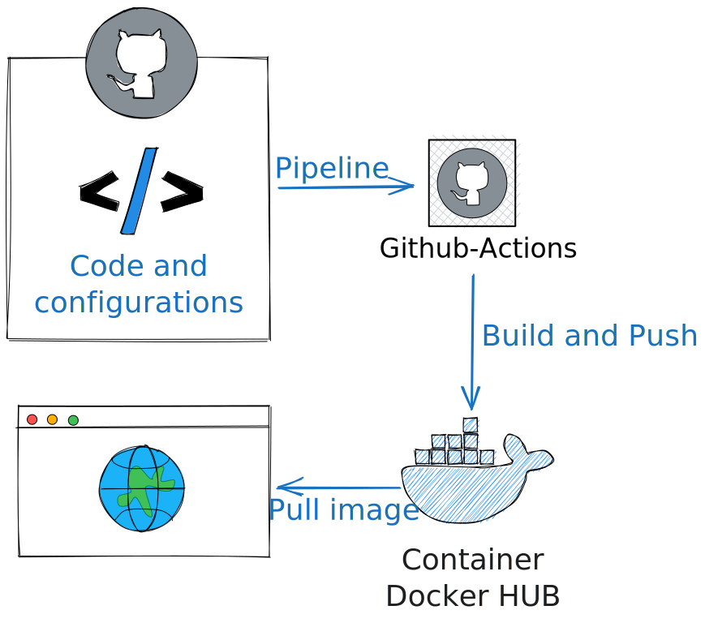

# Simplifiez vos déploiements avec GitOps : Un exemple concret de déploiement d'un conteneur web


# Introduction


Lorsqu'il s'agit de déployer des applications, les développeurs et les équipes opérationnelles (Ops) cherchent toujours des moyens de simplifier le processus et de gagner du temps. C'est là que le déploiement GitOps entre en jeu. Cette approche utilise Git comme source de vérité pour la configuration et la gestion des déploiements d'applications, offrant ainsi un moyen simple et reproductible de déployer vos applications. Dans cet article, nous allons explorer comment le déploiement GitOps vous permet de gagner du temps en simplifiant les déploiements, tant du point de vue des développeurs que des équipes Ops, en utilisant un exemple concret de déploiement d'un conteneur web avec Docker et GitHub Actions.

# Pourquoi gagner du temps avec le déploiement GitOps
Le déploiement GitOps offre plusieurs avantages qui permettent de gagner du temps lors des déploiements d'applications. Tout d'abord, en utilisant Git comme source de vérité, vous disposez d'un référentiel centralisé pour stocker toutes les configurations et les fichiers nécessaires au déploiement de votre application. Cela élimine la recherche fastidieuse des fichiers de configuration et facilite la gestion des différentes versions de votre application.

De plus, grâce à l'automatisation avec GitHub Actions, les déploiements sont exécutés de manière cohérente et répétable. Vous pouvez configurer des flux de travail (workflows) dans GitHub Actions pour déclencher automatiquement les étapes de construction et de déploiement de votre application dès que vous effectuez des modifications dans votre référentiel Git.

# Exemple de déploiement GitOps d'un conteneur web avec Docker et GitHub Actions
1. Créez un Git sur GitHub pour votre application.
2. Dans votre Git, créez un fichier Dockerfile pour décrire comment construire l'image Docker de votre conteneur web.
```
FROM nginx:latest
COPY index.html /usr/share/nginx/html/index.html
COPY style.css /usr/share/nginx/html/style.css
```
**Vous trouverez les fichier index.html et style.css sur le repository git**

3. Dans votre Git, créez un fichier de workflow GitHub Actions (par exemple, deploy.yml) pour automatiser le processus de déploiement.
```
name: Deploy to Docker

on:
  push:
    branches:
      - main

jobs:
  deploy:
    runs-on: ubuntu-latest

    steps:
      - name: Checkout code
        uses: actions/checkout@v2

      - name: Login to Docker
        uses: docker/login-action@v1
        with:
          username: ${{ secrets.DOCKER_USERNAME }}
          password: ${{ secrets.DOCKER_PASSWORD }}

      - name: Build and push Docker image
        uses: docker/build-push-action@v2
        with:
          context: .
          push: true
          tags: aguyonnet/deploiement-gitops:latest
      
      # You should have docker deamon running
      - name: Deploy to server
        run: |
          docker stop deploiement-gitops || true
          docker rm deploiement-gitops || true
          docker run -d -p 80:
```
**Pensez à renseigner vos credentials docker hub en secret de votre repository**

# Configuration des secrets dans GitHub
Pour pouvoir utiliser les secrets **DOCKER_USERNAME** et **DOCKER_PASSWORD** dans votre flux de travail GitHub Actions, vous devez les configurer en tant que secrets dans les paramètres de votre référentiel. Voici comment procéder :

1. Accédez à la page principale de votre référentiel GitHub.
2. Cliquez sur l'onglet "**Settings**" en haut de la page.
3. Dans la barre latérale gauche, cliquez sur "Secrets".
4. Cliquez sur le bouton "**New repository secret**" pour ajouter un nouveau secret.
5. Dans le champ "**Name**", saisissez **DOCKER_USERNAME**.
6. Dans le champ "**Value**", saisissez votre nom d'utilisateur Docker.
7. Cliquez sur le bouton "**Add secret**" pour enregistrer le secret.
8. Répétez les étapes 4 à 7 pour ajouter le secret **DOCKER_PASSWORD**.

Maintenant, vos secrets **DOCKER_USERNAME** et **DOCKER_PASSWORD** sont configurés dans les paramètres de votre référentiel et vous pouvez les utiliser dans vos workflows GitHub Actions.

# Tester le conteneur
[](http://play-with-docker.com/?stack=https://raw.githubusercontent.com/aguyonp/deploiement-gitops/main/docker-compose.yml)

Or run: 
```
docker run -d -p 80:80 aguyonnet/deploiement-gitops
```